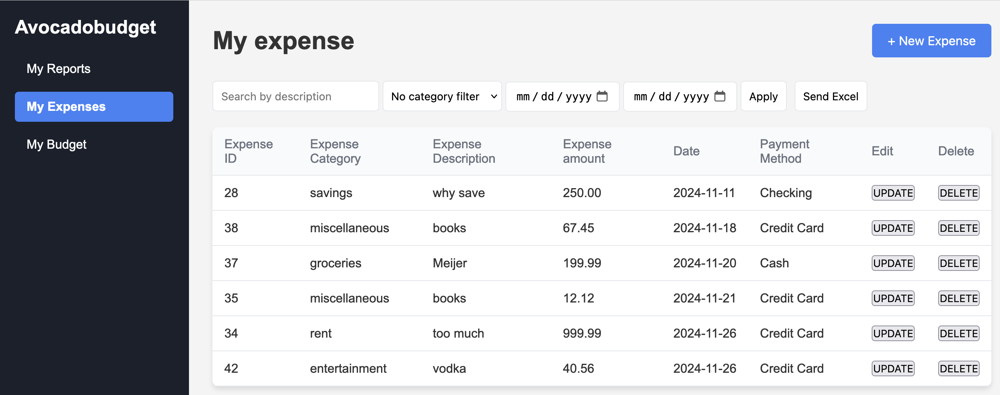
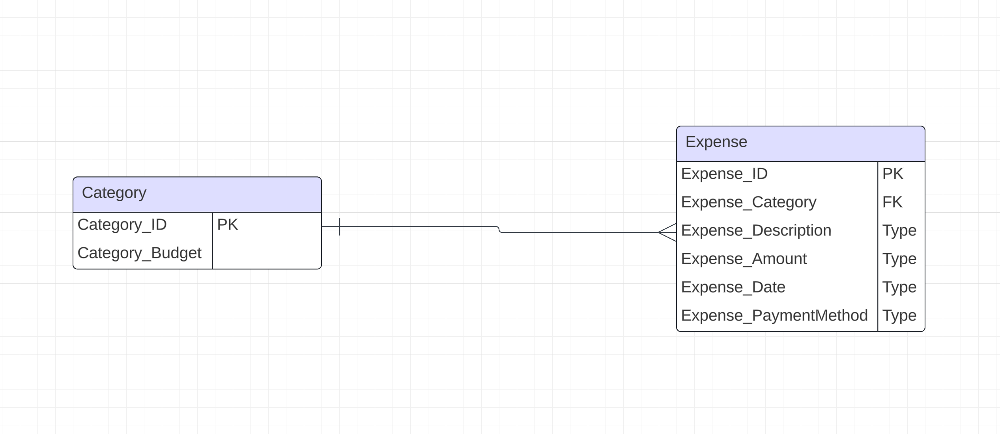

# Design Specification

## Requirement 1: The user shall be able to submit, delete, update and review their expenses

1. ***Crud*** The local web page will collect user entered expenses from html pages and store them in a SQLite database.
    - Flask will be used for front-end to back-end integration.
    - When the user wants to enter, update, or delete an expense it will run as an HTTP post request. This sends the user entered desired request based on the button clicked to python code. We will then use a DB class to store the expense in our database, delete the desired id, update the desired id or collect the required information to display on the expense management page. If we are reapplying the table after a filter, update, insert, or delete we will also refresh the page with a get request based on the currently selected filter options.
     

2. ***Database Design*** The default expense table will contain the following:
    - expense id (primary key)
    - expense category (foreign key category table)
    - expense description
    - expense amount
    - expense date
    - expense payment method
     
      
3. ***UI/UX*** Dedicated html page for inserting an expense
   - See the wifreframe section below
   - Default to current months expenses for display
   - expense category to use drop down to ensure that this field is controlled
   - payment method to use drop down to ensure that this field is controlled

4. ***HTML/CSS*** Page will need input box for each field above, button to pull up insert page, button for delete and edit. Will also need an apply button to apply filters to our dataset so the expense table only dsiplays the records on the page that we choose.
   - One page for displaying current expenses with filter options. Buttons for edit, delete on each record displayed. Then another button for inserting a new expense, finally another button to apply a filter and requery the expense table for display on the filter.
   - Another page for updating / inserting an expense once the insert button is clicked or a specific record is selected for an update.
   - Data validation provided, do not allow negative numbers and only allow valid floats for amounts. Other fields will require text, date, etc

5. ***Expense Class*** will be created in the back end code to assist with data validation, crud operations, changing an expense etc.
   - ***Class Variables***
      1. expenseID (id)
      2. expenseCategory (category)
      3. expenseDescription (description)
      4. expenseAmount (amount)
      5. expenseDate (date)
      6. expensePaymentMethod (payment)
    - ***Class Methods***
      1. ***__str__*** Returns a string of the expenses variables for the instance of expense
      2. ***validExpense*** Returns true or false depending on if expense instance is true or false
      3. ***returnExpense*** Returns one element list with tuple of expense object varaibles to be used for interting validated records.
      4. ***setID*** Change id member variable to the id passed to this method
      5. ***getID*** Return the current value of the member variable id.
      6. ***displayInvalidVariables*** Return a string listing all the invalid variables passed when making expense object. This can be used to identify what was wrong in making the expense object. This become obsolete as we choose to use HTML to validate data going into expense object. 
6. ***DB class*** to handle connections, db crud methods by page, etc (this section will build out as the db class is written and expands)
      1. ***DB variables***
         - none so far
      3. ***DB methods***
      - ***getConnection*** This function returns var that represents an object that provides a connection to the db file provided. This object will be provided to the various class methods required to read, delete, update, or insert to our various tables.
      - ***insertExpense*** This function will take in a tuple of expense fields along with a connection object in order to insert a new record to the expense table
      - ***maxpenseID*** This function will take in a connection object and collect the max id in the expense table then add one and return that value, if there are no records in the table, then return the value of 1 to start the ids for the table.
      - ***getExpenseTable*** This function will return all the records in the expense object table, later refinement will allow you to provide custom filtering to the table.
     - ***deleteIDExpense*** This function will delete the id passed to the function if it exists in the expense table
     - ***updateIDExpense*** This function will update the id passed to the function to capture any desired changes to the existing record. This will only work if the id passed has a matching id in the expense table. We will also pass a tuple with the fields of the corrected item. We will techinically insert new record to new id, then delete the old record for the id we want to replace, then we will change id of duplicate record to match the desired id to replace. This is more effiecent than updating all the fields.
     - ***selectIDExpense*** This function returns the expense from the expense table based on the ID passed to the function.
     - ***selectParamsExpense*** This function will build a dynamic SQL query based on the variables passed as options from filter. If variable passed is none, we do not add that string section to the SQL statement that we build. This way we only filter on the items that actually have a value passed. This is used for our apply button on the expense table page and allows for dynamic table results.
     - ***sumExpenseByCategory*** Sum amounts by category for each category passed in array. Store in dictionary and return dictionary to the calling location.
     - ***getCategoryTable*** Return array holding each record in the category table.
     - ***selectSingleCategory*** Pass a single category to the this function and return the result for that (one record)
     - ***updateCategoryAmount*** Update category amount, based on object passed to this function, then get category table and return to calling location
       
## Requirement 2: The user shall be able to access a general built-in monthly budget template by providing their income if they choose to have the app help them

1. The built in budget template will produce a general expense template table with recommended expense allocation based on the user's entered net monthly income 
   - Clicking the calculate budget button on the category page will take the income the user entered into the monthly income box and apply default % values for the categories, to build the customer's default template in the categories table

2. The default category table will contain the following fields in SQLite:
   1. ***category*** - will be text describing the category that the expenses will take (also the primary key) The categories will be defined for the program and they are below.
    - rent
    - groceries
    - entertainment
    - miscellaneous
    - bills/subscriptions 
    - savings
    2. ***category amount*** to define the monthly budget for each category

3. There will be validation to ensure that negative values are not allowed, also only allow valid floats for income and amounts.

4. The gui interface will allow editing of the amounts by category. It will not allow you to add categories or remove them. Also, clicking calculate budget button will recalculate the tables based on custom percentages built in the backend code. We researched reasonable targets for budget percentage to apply by default. 

5. The DB class will add methods to handle changes to category table, this will be documented in requirement one. 

6. Categories will be fixed, as of now plan is to only offer what is displayed.

## Requirement 3: The user shall be able to provide personalized numbers to their budget

1. This means that the user can bypass our recommended budget allocation algorithm that is based on user monthly net income and use their own budget allocation.
    - There is a button to update the amount allocated, when a new amount is saved, a new percentage will be calculated with back-end code.
2. This will use the same interface and page as the default budget feature

## Requirement 4: The user may be able to access an intuitive reporting system that displays their results

1. When the user wants to retrieve their expenses, a get request will be sent to flask and this will query the expense records from the database based on different filters
    - The user can retrieve expenses by providing a date range, category, and/or descripion that will send a query to the database and display it back to the user's html page. We improved this option to be very flexible. 

## Requirement 5: The user may be able to compare their current monthly expense report to older monthly reports
1. The back-end will send a range of dates to the database and query the expense results for those date ranges.
    - Will be displayed in form of a bar chart.
    - Line will be used to track expense vs budget
    - Month to month checks can be conducted by selecting a month and year to display, then clicking a button to display the graph for that selection.

## Requirement 6: The user shall be able to access the application without internet access.
1. Set to run on a local system which doesn't require internet access.

## Requirement 7: The user shall be able to access all features with minimal amount of local storage
1. The program is extremely small (< 1GB) and stores less than 1GB.

## WIREFRAME
1. ***My Reports page***
    - The my report page displays a financial dashboard from "Avocadobudget," focusing on "My Reports". It features a bar chart comparing set budgets ("Spend up to") and actual spending across expense categories. Users can adjust the month and generate reports using the dropdown and "Apply" button.

2. ***My Expense page***
    - The "My Expense" page allows users to manage their spending records. Users can:
    1. Search for specific expenses using a description or by selecting a category from the dropdown menu.
    2. Filter expenses based on a date range and apply the filter to view relevant transactions.
    3. View a table listing expense details, including:
        - Expense ID
        - Date
        - Payment Method (e.g., Credit card, Cash, Debit card)
        - Total amount spent
        - Expense description
        - Expense category
3. Each record has "Update" and "Delete" options, enabling users to modify or remove expenses. Additionally, there is a "New Expense" button for adding new transactions manually.

3. ***My Budget Page***
    - The "My Budget" page allows users to manage and allocate their monthly income across different expense categories. Here's how it works:
    1. ***Monthly Income Input***: Users can enter their monthly income in the provided field and click "Calculate Budget" to update it, this will also take that income and build budget based on defined % in backend code.
    2. ***Expense Categories***: A list of predefined categories.
        - The percentage of income allocated to that category.
        - The corresponding amount in dollars.
    3. ***Edit Option***: Users can modify the amount for each category by clicking the "Update" button next to each entry.
    - This page helps users plan their budgets effectively based on income and expenditure preferences. 
    

