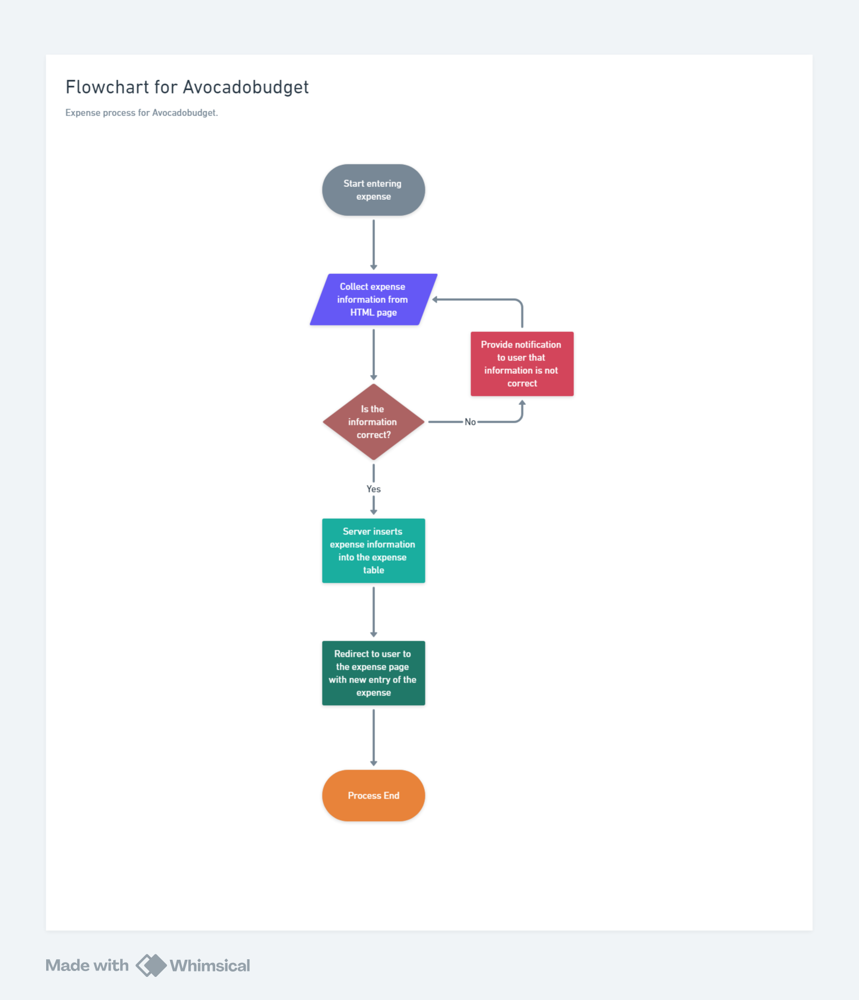

# Administrivia
- 10/8/2024
- Time: 1:00pm
- Location: Main campus library
- Scribe: Owen Hill

# Agenda
- Item 1: Complete design document

- Item 2: Discuss ui/ux

# Notes
- Owen, Dan: Backend and database design
- Everyone: Front-end to back end integration design
- Dev, Abhik: Front-end design

# Action Items
- Everyone: complete design by next meeting time

- Everyone: Start the technical work of the design

# Flow-Chart from Class
- flow chart for entering a new expense

# Signatures

- Owen Hill
- Abhik Ashwinkumar Patel
- Daniel Cronauer
- Devkumar Patel

