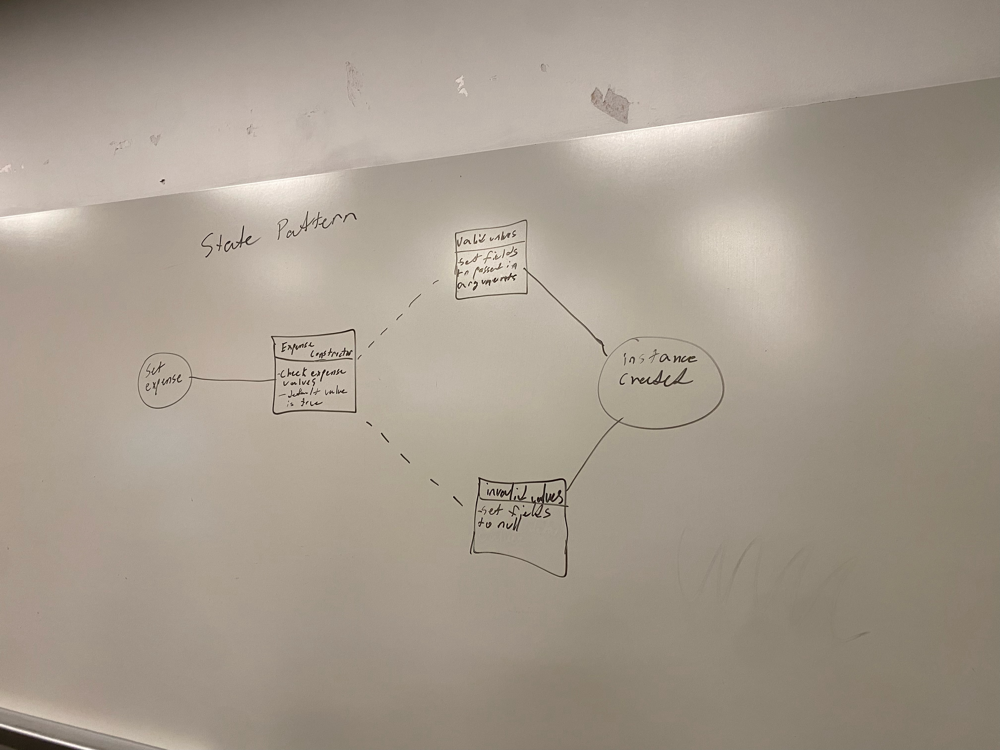

# Meeting Notes (10/22/2024)

## Administrivia
* Time: 1:30pm
* Location: library
* Scribe: Owen Hill

## Agenda

- Item 1: Discuss our technical progress in our individual aspects of the project
- Item 2: Discuss a design pattern that fits our project

## Notes
- Dev: Showed his html/css code he has been working on, based on Ahbik's figma design.
- Daniel: Showed his progress on the backend and database integration and what he is still working on.
- Owen: Going to work database schema and business logic.
- Abhik: Chnage some designing stuff according to requirements.

## Action Items
- Everyone: Keep working on the topics discussed in the notes above as there is nothing else to do right now.

## Design Pattern from class

- Design Pattern description: 
    1. Shows the validation process when an instance of an expense object is created.
    2. Checks if arguments passed are valid (correct type and within bounds if applicable).
    3. This method handles database entry errors that would mess up the database.

## Signatures
- Owen Hill
## State Design Pattern from class

- Design Pattern description State Design Pattern:
    1. Shows the validation process when an instance of an expense object is created. Default is to define expense object variable valid as true.
    2. Checks if arguments passed are valid (correct type and within bounds if applicable).If they are not valid, then changes the expense object status for valid as false.
    3. This method handles database entry errors that would mess up the database. This status is used to handle errors and route the user to the proper screen and process depending on the state of the expense object.

## Signatures
- Owen Hill
- Abhik Ashwinkumar Patel
- Devkumar Prakashbhai Patel
- Daniel Cronauer

