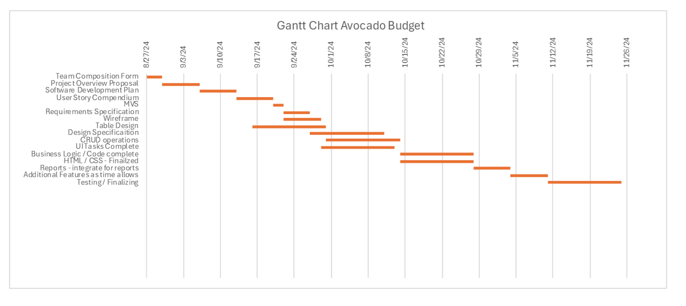

# Software Development Plan
Members:
- Daniel Cronauer
- Abhik Ashwinkumar Patel
- Devkumar Prakashbhai Patel
- Owen Hill

## Administrative 

###  Meeting Location(s)

- Flexible meeting locations; we aim to use discord and campus library for our scrum meetings

###  Meeting Time(s)

- Every Tuesday for at least 20 minutes on campus, target time to start between 1:00PM and 1:30PM
- Additional meetings will be scheduled as needed

### Communication Plan
- Meeting Cadence - At least once per week
- Meeting Structure - Each person will answer the following three questions: what we are working on? What we are going to work on? Is anything blocking me from completing said work?

### Communication Mechanisms
- Discord
- Email
- SMS text
- Directly after class
- Response time to be within a day

### Project Management

- We plan to use feature-driven agile methodology in order to track, prioritize and implement our project. We will break up our user stories into features that will be assigned to each member based on their defined contribution for the project. Our milestones will break out parts of project into front end and back end milestones in order to ensure that we sequence the steps in the proper order. 

# SDLC Details

## Timeline (MVSs, Milestones, Requirement specifications, and Design Specifications)

### Gannt Chart for Project

### Key due dates from Gantt Chart in table form

| Task  | Expected Start Date | Expected End Date | Estimated Date to Complete |
| :-------------: | :-------------: | :-------------: | :------: |
|Team Composition Form|8/27/24|8/30/24|3|
|Project Overview Proposal|8/30/24|9/6/24|7|
|Software Development Plan|9/6/24|9/13/24|7|
|User Story Compendium|9/13/24|9/20/24|7|
|MVS|9/20/24|9/26/24|6|
|Requirements Specification|9/22/24|9/27/24|5|
|Wireframe|9/22/24|10/6/24|14|
|Table Design|9/16/24|10/7/24|21|
|Design Specificaition|9/27/24|10/11/24|14|
|CRUD operations|9/30/24|10/14/24|14|
|UI Tasks Complete|9/29/24|10/13/24|14|
|Business Logic / Code complete|10/14/24|10/28/24|14|
|HTML / CSS - Finailzed|10/14/24|10/28/24|14|
|Reports - integrate for reports|10/28/24|11/4/24|7|
|Additional Features as time allows|11/4/24|11/11/24|7|
|Testing / Finalizing|11/11/24|11/25/24|14

### Justify CP and PM Choices
- ***CP*** - This is a plan we all have agreed upon and a plan that we have already implemented for the couple of assignments. We haven't had any issues yet as all of our members spend a lot of time on campus everyday so it's not difficult to stick to our plan.

- ***PM*** - We planned our deadlines around what we believe to be the worst case-scenario. We agreed that with our teams given skill sets, we should be able to successfully finish everything before our given deadlines in the gannt chart. To be safe we gave a bit of extra time for each deadline.
